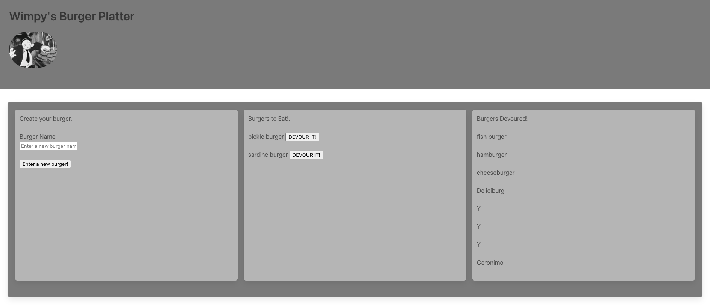

# Wimpy's Burger Logger

## Description

This application uses handlebars, express, a MySQL database and a custom ORM to handle user input on the main interface. This project follows the MVC pattern. The deployed site illustrates these operations by allowing a user to 'create' and 'destroy'(eat) burgers and displays the eaten burgers in another column.

## Table of contents

- [General Info](#general-info)
- [Burger Page](#burger-page)
- [Technologies](#technologies)
- [Author](#author)
- [Questions](#questions)

## General Info

This application is deployed [here](https://wimpys.herokuapp.com/) on heroku.

## Burger Page

## Technologies

This project was created with:

- [JavaScript](https://www.javascript.com/)

- [JQuery](https://jquery.com/)

- [Express](https://www.npmjs.com/package/express)

- [Node](https://www.npmjs.com/package/node)

- [Handlebars](https://www.npmjs.com/package/express-handlebars)

- [MySQL](https://www.npmjs.com/package/mysql)

- [BulmaCSS](https://bulma.io/)

## Author

- [Shawn Flanigan](https://github.com/Shawnmflanigan/welcome_to_wimpys)

## Questions

- If you have any questions about installing this application locally please feel free to reach out to me [here](theshawns@gmail.com)
